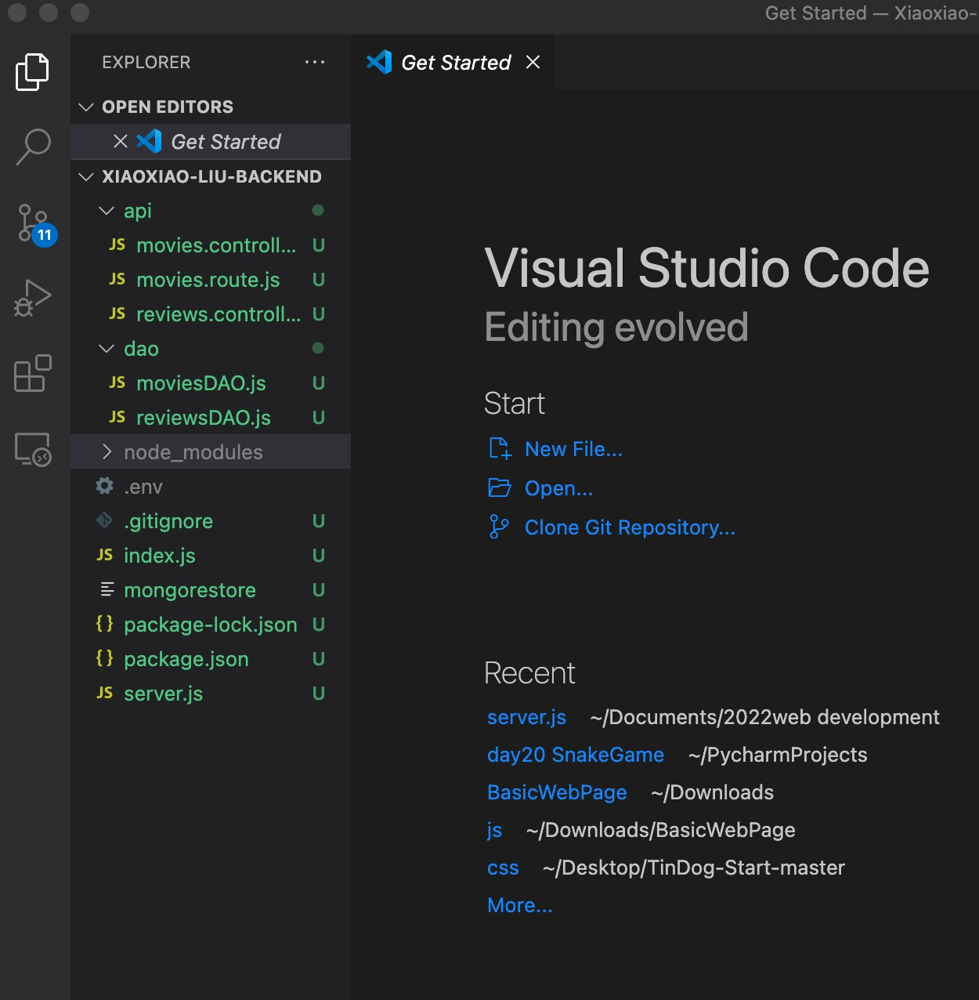
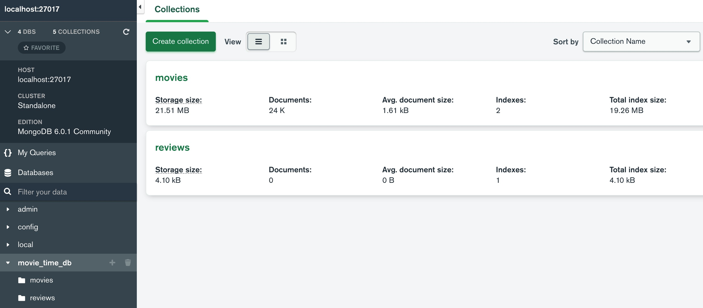

# Xiaoxiao-Liu-backend
HW3
Sucessfull add review in mongodb reviews. Implemented PUT and DELETE successully.

1. Add review in db reviews

2. Update review

3. Delete review

HW2
I successfully created the backend repo with all the requirements completed and installed MongoDB.

1. Xiaoxiao Liu-backend VSC directory structure

2. MonggoDB compass movie_time_db

